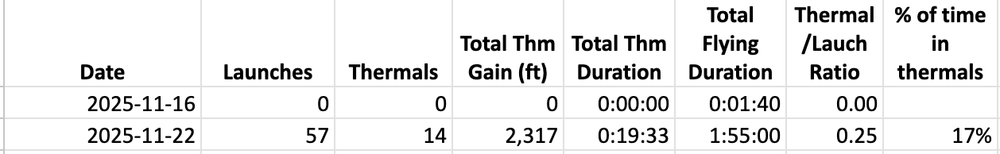

### About Osprey
Osprey provides insights into how many thermals you are catching, how long you're in them, and the altitudes where you are entering and exiting them. You can use these analytics to better understand your thermaling performance and track your progression over time.

### How Osprey Works
Oprey processes altitude and rate of climb data in Spektrum TLM files to indentify the points where the glider peaks in a thermal, peaks after a launch, or reaches a trough in between the two. Once Osprey completes this analysis, it generates an Excel (XLSX) file with altitude charts for each flying session annotated with the start and end of each thermal.  Osprey also maintains a separate Excel file that logs the history of your daily soaring stats. To use Osprey, you need a Spectrum reciever that emits vario telemetry data such one listed [here](https://www.spektrumrc.com/radios/aircraft/receivers/?cgid=radios-aircraft-receivers&prefn1=integratedVariometer&prefv1=Yes&srule=best-matches&sz=24).  Osprey is written in Python, and is provided with executables for both Windows and MacOS. Below are samples of Osprey analytics.

**Session Altitude Chart with Thermal Annoations**
 
 
 

**Session Summary Table**
 
 
 

**Thermal Summary Table**
 
 
 

 **Daily Soaring Log** 
 
### Getting started with Osprey

1. **Capture vario data** Set up your Spektrum transmitter to write telemetry data to your memory card.  In your transmitter's Telemetry view, click on "File Settings" and configure the file name and the trigger to initiate telemetry recording for a flying  session.  On my trasmitter I use the throttle cut switch to trigger telemetry recording (i.e. throttle cut OFF initiates recording). 

2. **Copy the TLM file to your computer** After flying, copy the TLM file from the card to your computer using a card reader.  Then delete the TLM file on the memory card.  If you do not delete the file on the card, the next time you use Osprey it will process the new sesssions as well as older ones.

3. **Install Osprey**  Click the green 'Code' button at the top of this page and select 'Download ZIP'.  Double click on the ZIP to open it.

4. **Run Osprey**  You can use the executables for Mac or Windows, or run the Osprey Python script. The first time Osprey runs, you will be asked to select units of measure (metric or imperial).  Then you will be asked to select the TLM file.  Osprey will then process the file and write the XLSX files to the same location.

5. **Review your analytics** If you have Excel on your computer, double click either XLSX file to view the analytics sheets.  Otherwise, upload your files to Google Drive and use Google Sheets to view them (that's what I use).

### Next steps
Osprey software was developed using telemetry data from electric gliders. It will likely work for DLG gliders -- I just haven't had any test data. If you have a DLG glider, post an issue by navigating to the top of this page and clicking the Issues tab and attach your TLM data.

