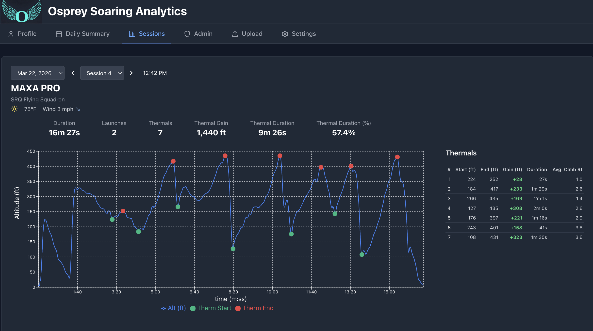
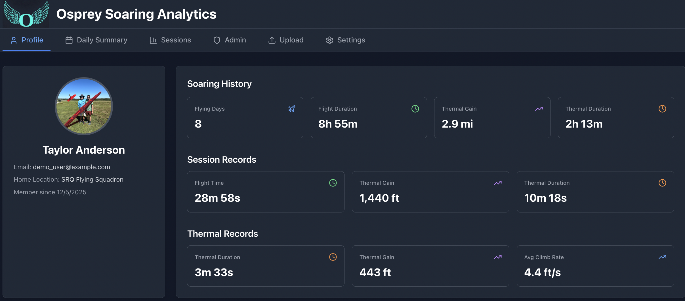
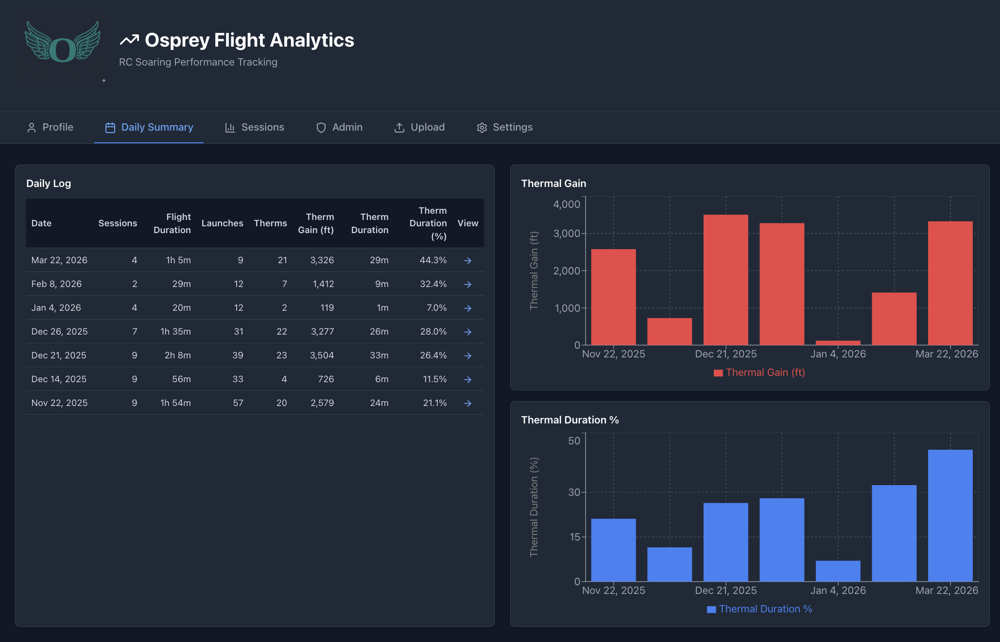
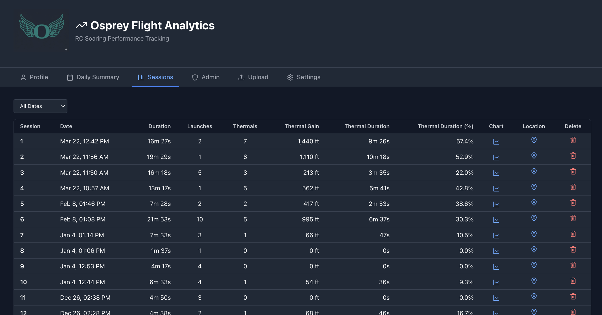

# Osprey Flight Analytics

Osprey is a web app that generates soaring analytics for RC sailplanes. It analyzes altitude and variometer telemetry data from [Spektrum receivers](https://www.spektrumrc.com/aircraft-receivers/) to track thermalling performance and progression over time.



## Features

- **Session Charts** — Altitude profiles with thermal start/end markers for every flying session
- **Thermal Detection** — Automatically identifies thermals, launches, and troughs from variometer data
- **Session Charts** — Altitude profiles with thermal start/end markers for every flying session
- **Weather Snapshot** — Weather conditions based on soaring location and session start time"
- **Daily Summary** — Bar charts showing thermal gain and duration by day
- **Soaring Log** — Lifetime totals for flight time, thermal gain, and thermal duration
- **Session & Thermal Maximums** — Personal records with one-click navigation to session details
- **Imperial / Metric** — Toggle between ft and m in **Settings**

## How It Works

Osprey parses `.TLM` files from Spektrum receivers. It downsamples altitude and variometer data at 1 Hz and applies a moving average to smooth the altitude data. It then identifies:

- **Thermal peaks** — local altitude maxima above a minimum height threshold
- **Launch peaks** — points associated with high climb rates (motor launches)
- **Trough bottoms** — local altitude minima between events

Caught thermals are identified by working backwards from each thermal peak to find the corresponding launch peak or trough bottom. This processed telemetry is then stored in a PostgreSQL database and served via a FastAPI backend to a React frontend.

## Stack

| Layer | Technology |
|---|---|
| Frontend | React, Recharts, Tailwind CSS |
| Backend | Python, FastAPI |
| Database | PostgreSQL |
| Deployment | Docker Compose |

## Getting Started

### Prerequisites

- [Docker Desktop](https://www.docker.com/products/docker-desktop/)
- A Spektrum receiver that records vario telemetry (see [compatible receivers](https://www.spektrumrc.com/radios/aircraft/receivers/?cgid=radios-aircraft-receivers&prefn1=integratedVariometer&prefv1=Yes))

### Running Locally

1. Clone the repo:
```bash
   git clone https://github.com/taylor-anderson821/Osprey.git
   cd Osprey
```

2. Copy the environment file and configure if needed:
```bash
   cp .env.example .env
```

3. Start all services:
```bash
   docker-compose up
```

4. Open [http://localhost:5173](http://localhost:5173) in your browser.

## Setting Up Your Transmitter to Capture Telemetry

In your Spektrum transmitter's **Telemetry** view, go to **File Settings** and configure:
- A file name for the TLM output
- A trigger switch to start/stop recording (e.g. a throttle cut switch)

### Uploading Data to Osprey

1. After flying, copy the `.TLM` file from your Spektrum transmitter's memory card to your computer.
2. In Osprey, navigate to **Upload** and select the TLM file.  You can also find sample TLM files under `/sample data`.
3. Osprey processes the file and adds all sessions to the database.

## Screenshots







## Notes

- Osprey distinguishes between launches and thermals based on the rate of ascent. If you launch at a shallow or moderate climb rate (e.g. < 20 ft/s), Osprey will classify the launch as a thermal.
- Osprey was developed using telemetry from electric gliders. DLG glider data should also work, though the thermal detection algorithm has not been tested on that data.